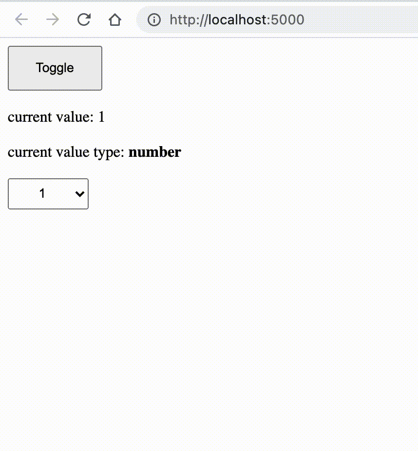

# 自我介绍

该项目是 `vue` 的一个 `bug` 演示。

- 该 bug 复现需要 **`先 build`**，再访问 build 好的文件，**dev 模式下无法触发**
- 经过测试，`webpack` 和 `vite` 打包都能复现
- 经过测试，**`ref`** 和 **`reactive`** 都有这个问题

# 食用方式

- 克隆该项目到本地
- `yarn`
- `yarn build`
- `serve -s dist`
- 访问 `localhost:5000`

# bug 复现流程

- 刚进入页面的时候，`切换select`，数据类型会一直是`number`
- 点击 `toggle` 隐藏
- 再点击 `toggle` 显示
- 再次点击 `select` 切换数据的值，此时数据类型会变为 `string`
